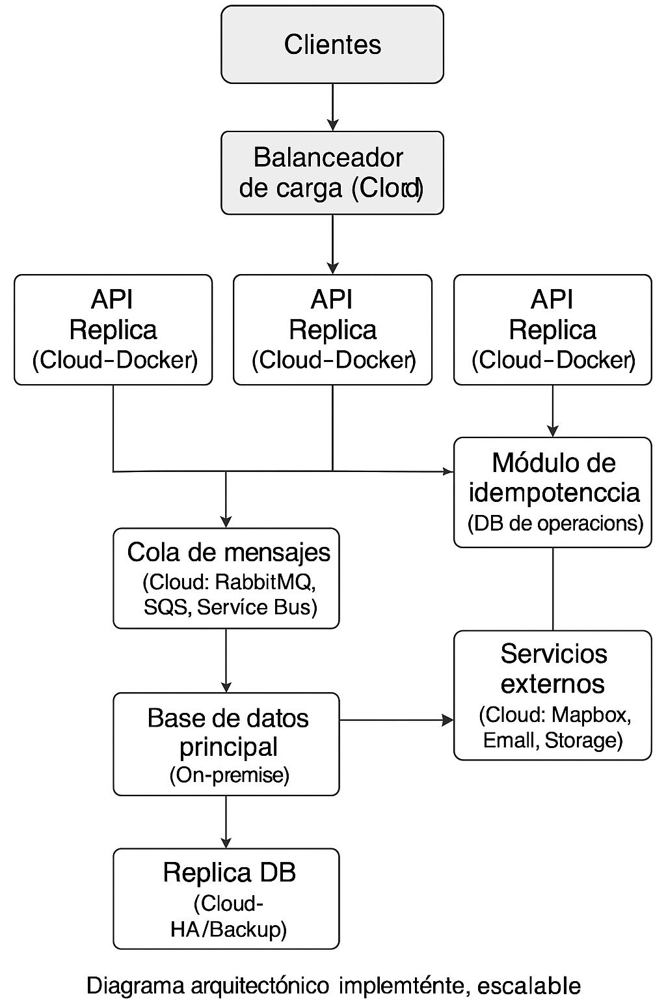

# Event Management API (.NET 8, C#)

**Plataforma de Gestión de Eventos**

**Desarrollador:** Jhon Alexander Bobadilla Lombana

---

## 1. Descripción

Event Management API es una plataforma backend desarrollada en .NET 8 y C# bajo el patrón Clean Architecture, que permite la gestión profesional de eventos, usuarios y asistentes. Integra autenticación JWT para máxima seguridad y la API de Mapbox para consultar direcciones y lugares de interés cercanos a cada evento. Incluye funciones para carga masiva de eventos por Excel, mediante la API EPPlus, gestión CRUD completa y documentación interactiva mediante Swagger. Ideal para proyectos de eventos, turismo y logística que requieran escalabilidad y robustez. 

---

## 2. Tabla de Contenidos

- [Instalación](#instalación)  
- [Estructura del Proyecto](#estructura-del-proyecto)  
- [Modelo de Datos](#modelo-de-datos)  
- [Modelo Relacional](#modelo-relacional)  
- [Configuración JWT y Seguridad](#configuración-jwt-y-seguridad)  
- [Ejecución e instalación](#ejecución-e-instalación)  
- [Control de versiones y ramas Git](#control-de-versiones-y-ramas-git)  
- [Scripts SQL (DDL, DML) y Consultas CRUD](#scripts-sql-ddl-dml-y-consultas-crud)
- [Dockerización de la API](#dockerización-de-la-api)
- [Integración y Despliegue Continuo (CI/CD)](#integración-y-despliegue-continuo-cicd)
- [Diagrama arquitectónico](#diagrama-arquitectónico)
- [Video Explicativo](#video-explicativo)  
 
---

## 3. Instalación

### Clonar el repositorio

```bash

git clone https://github.com/JhonBobadilla/event-management-api-dotnet.git
cd event-management-api-dotnet
```

Requisitos

- .NET 8 SDK instalado
- PostgreSQL configurado con la base de datos event_management_db
- Editor/IDE recomendado: Visual Studio Code o Visual Studio 2022 


---

## 4. Estructura del Proyecto

/EventManagement.Domain           # Entidades y contratos (C#)
/EventManagement.Application      # Casos de uso y lógica de negocio
/EventManagement.Infrastructure   # Acceso a datos y servicios externos
/EventManagement.Presentation     # API RESTful (.NET 8, C#)

---

## 5. Modelo de Datos

La plataforma está basada en tres entidades principales:

User: Usuario autenticado, creador de eventos en la plataforma.

Event: Evento gestionado en la plataforma, con información de título, descripción, fecha, ubicación, coordenadas y creador.

Attendee: Persona registrada como asistente a un evento (puede ser usuario registrado o invitado externo).

El modelo relacional está representado en el siguiente diagrama :

- Scripts de Base de Datos (DDL y DML)

Para facilitar la creación y carga inicial de datos en PostgreSQL, se incluyen los siguientes scripts en la carpeta /docs del repositorio:

ddl_event_management.sql: Script DDL para crear las tablas principales.
dml_event_management.sql: Script DML con inserciones de datos de ejemplo.

- Script DDL – Creación de Tablas

```sql
CREATE TABLE "User" (
    "Id" SERIAL PRIMARY KEY,
    "FirstName" VARCHAR(50) NOT NULL,
    "LastName" VARCHAR(50) NOT NULL,
    "Email" VARCHAR(100) UNIQUE NOT NULL,
    "PasswordHash" VARCHAR(200) NOT NULL,
    "Phone" VARCHAR(20),
    "City" VARCHAR(100),
    "CreatedAt" TIMESTAMP DEFAULT CURRENT_TIMESTAMP
);

-- Tabla de eventos
CREATE TABLE "Event" (
    "Id" SERIAL PRIMARY KEY,
    "Title" VARCHAR(150) NOT NULL,
    "Description" VARCHAR(500),
    "Date" TIMESTAMP NOT NULL,
    "Location" VARCHAR(150),
    "Address" VARCHAR(200),
    "City" VARCHAR(100),
    "Latitude" FLOAT,
    "Longitude" FLOAT,
    "CreatedBy" INTEGER NOT NULL REFERENCES "User"("Id") ON DELETE CASCADE,
    "CreatedAt" TIMESTAMP DEFAULT CURRENT_TIMESTAMP
);

-- Tabla de asistentes
CREATE TABLE "Attendee" (
    "Id" SERIAL PRIMARY KEY,
    "FirstName" VARCHAR(50) NOT NULL,
    "LastName" VARCHAR(50) NOT NULL,
    "Email" VARCHAR(100) NOT NULL,
    "Phone" VARCHAR(20),
    "City" VARCHAR(100),
    "Address" VARCHAR(200),
    "RegisteredAt" TIMESTAMP DEFAULT CURRENT_TIMESTAMP,
    "EventId" INTEGER NOT NULL REFERENCES "Event"("Id") ON DELETE CASCADE,
    "UserId" INTEGER REFERENCES "User"("Id")
);
```
- Script DML – Inserción de Datos de Ejemplo

```sql
INSERT INTO "User" ("FirstName", "LastName", "Email", "PasswordHash", "Phone", "City")
VALUES
  ('Jhon', 'Bobadilla', 'jhonprueba@correo.com', '123456', '3200000000', 'Bogotá'),
  ('Camila', 'López', 'camila@correo.com', 'abcdef', '3112223344', 'Medellín');

-- Eventos de ejemplo
INSERT INTO "Event" ("Title", "Description", "Date", "Location", "Address", "City", "Latitude", "Longitude", "CreatedBy")
VALUES
  ('Conferencia Internacional', 'Un evento técnico para la comunidad.', '2025-06-25 09:00:00', 'Auditorio Principal', 'Calle 123 # 45-67', 'Bogotá', 4.60971, -74.08175, 1),
  ('Feria Tecnológica', 'Evento anual de tecnología.', '2025-07-10 08:00:00', 'Plaza Mayor', 'Cra 15 # 100-50', 'Medellín', 6.24420, -75.58121, 2);

-- Asistentes de ejemplo
INSERT INTO "Attendee" ("FirstName", "LastName", "Email", "Phone", "City", "Address", "EventId", "UserId")
VALUES
  ('Joseph', 'Borda', 'joseph@correo.com', '3207512548', 'Bogotá', 'Calle 123 #45-67', 1, 1),
  ('Luis', 'Torres', 'luis@correo.com', '3105559999', 'Medellín', 'Calle 51 #60-70', 2, NULL);
```
- Consultas SQL CRUD Básicas para la tabla Event

```sql
INSERT INTO "Event" ("Title", "Description", "Date", "Location", "Address", "City", "Latitude", "Longitude", "CreatedBy")
VALUES (
  'Seminario de Prueba',
  'Descripción de ejemplo.',
  '2025-08-01 10:00:00',
  'Centro de Convenciones',
  'Carrera 10 # 20-30',
  'Cali',
  3.4516,
  -76.5320,
  1
);

Actualizar un evento

UPDATE "Event"
SET "Title" = 'Título Actualizado', "City" = 'Barranquilla'
WHERE "Id" = 1;

Eliminar un evento

DELETE FROM "Event" WHERE "Id" = 1;

```
Los scripts completos para la creación de tablas e inserción de datos se encuentran en la carpeta /docs del repositorio.

---

## 6. Modelo Relacional


---

## 7. Configuración JWT y Seguridad

En appsettings.json, configure la clave secreta para JWT:

```csharp
"Jwt": {
    "Key": "************"
  }
```

La API protege sus endpoints mediante autenticación JWT. Solo usuarios con token válido pueden realizar operaciones que modifiquen datos.

La configuración de autenticación está implementada en Program.cs:

```csharp
builder.Services.AddAuthentication(JwtBearerDefaults.AuthenticationScheme)
    .AddJwtBearer(options =>
    {
        options.TokenValidationParameters = new TokenValidationParameters
        {
            ValidateIssuerSigningKey = true,
            IssuerSigningKey = new SymmetricSecurityKey(Encoding.ASCII.GetBytes(jwtKey)),
            ValidateIssuer = false,
            ValidateAudience = false
        };
    });
```
---

## 8. Instrucciones de instalación y ejecución

1. Desde la terminal, en la carpeta `EventManagement.Presentation`, ejecuta:

```bash
dotnet build
dotnet run
```
2. La API estará disponible con Swagger en:

http://localhost:5150/swagger/index.html

3. Registro de usuario

Antes de iniciar sesión, registra un usuario usando el endpoint:POST /api/Auth/register
Haz clic en Try it out y envía un cuerpo como este:

```JSON
{
  "firstName": "Jhon",
  "lastName": "Bobadilla",
  "email": "jhonprueba@correo.com",
  "password": "123456",
  "phone": "3200000000",
  "city": "Bogotá"
}
```
- Si la operación es exitosa, verás:

```JSON
{
  "message": "Usuario registrado exitosamente."
}
```
4. AUTENTICACIÓN:

- Dirígete a POST /api/Auth/login → haz clic en Try it out.
- Reemplaza el cuerpo con el correo y contraseña del usuario recién registrado, manteniendo el formato JSON:

```JSON
{
  "email": "jhonprueba@correo.com",
  "password": "123456"
}

```
- Haz clic en Execute y copia el token que se muestra.

5. AUTORIZACIÓN

- Haz clic en el botón Authorize (esquina superior derecha).
- En el prompt, escribe Bearer, (seguido de un espacio) pega el token copiado.

  formato correcto:   Bearer eyJhbGciOi.........4f8uQ7Suo 
  formato incorrecto (Swagger lo pega así): Bearer {"token": "eyJhbGciOi.........4f8uQ7Suo"} 

Borra los caracteres que sobran al inicio: ({"token": ") y al final ("}), hasta dejarlo en el formato correcto.

Recomendación:
Copia el token desde la consola del backend (donde también se imprime limpio).

Con esto podrás autenticarte correctamente y probar todos los endpoints protegidos como GET /api/Events.

---

6. Creación de eventos manualmente y con el excel

- CREACIÓN MANUAL 

- Crea un evento manualmente usando el endpoint: POST /api/Events
  Haz clic en Try it out y envía un cuerpo como este:

```JSON
{
  "title": "Conferencia Internacional",
  "description": "Un evento técnico para la comunidad.",
  "date": "2025-06-25T09:00:00",
  "location": "Auditorio Principal",
  "address": "Calle 123 # 45-67",
  "city": "Bogotá",
  "latitude": 4.60971,
  "longitude": -74.08175
}
```
- CREACIÓN MASIVA MEDIANTE ARCHIVO DE EXCEL  

Descarga la plantilla de Excel "plantilla_eventos.xlsx" que está en la carpeta /docs del repositorio.

Llena los eventos siguiendo el formato exacto de la plantilla.

Ve a POST /api/Events/upload-excel en Swagger, haz clic en Try it out y adjunta tu archivo Excel usando el campo file.

Haz clic en Execute.

Si el proceso es exitoso, verás un mensaje confirmando cuántos eventos fueron registrados.

Nota: Todos los eventos del archivo serán agregados como si los hubieras registrado uno a uno usando el endpoint manual.

7. Consulta de eventos

Puedes ver todos los eventos usando el endpoint GET /api/Events.

8. Registro de Asistentes a Eventos

La API permite registrar asistentes a un evento específico de forma sencilla y flexible. Cada asistente puede ser un usuario registrado o un invitado externo, y la información queda almacenada y asociada al evento correspondiente. 

- Cómo funciona: 

Puedes registrar asistentes a cualquier evento mediante el endpoint: POST /api/Attendees/register

Debes enviar en el cuerpo de la solicitud (body) los datos del asistente y el evento al que se va a inscribir, en formato JSON.

Cuerpo de la petición (ejemplo):

```JSON
{
  "eventId": 17,
  "firstName": "Joseph",
  "lastName": "Borda",
  "email": "joseph@correo.com",
  "phone": "3207512548",
  "city": "Bogotá",
  "address": "Calle 123 # 45-67"
}
```
9. Geolocalización: Consulta de Direcciones y Lugares Cercanos

La API integra la funcionalidad de búsqueda de direcciones y lugares de interés cercanos a las cordenadas del evento consultado utilizando el servicio de Mapbox, cada evento almacena coordenadas geográficas (latitude y longitude), que son las que se envian a la Api externa y esta devuelve los lugares y direcciones de interés. 

- Cómo funciona:

Puedes consultar lugares cercanos a un evento mediante el endpoint: GET /api/Events/{id}/nearby, ingresa el id del evento a consultar, el parámetro radius es opcional y define el radio de búsqueda en metros (por defecto 500m, máximo 10,000m).

Cada elemento incluye:

name: Nombre de la dirección o lugar de interés.
type: Puede ser "address" (dirección) o "poi" (lugar de interés).
latitude y longitude: Coordenadas del lugar encontrado.
distance: Distancia en metros desde el evento consultado.

Detalles técnicos

- El servicio usa Mapbox Geocoding API y retorna hasta 10 resultados relevantes (direcciones y lugares de interés), la búsqueda considera ambos tipos (address y poi) para mayor utilidad.

- Nota sobre las coordenadas

Las coordenadas deben ingresarse correctamente como números decimales (latitude, longitude).

Ejemplo para Bogotá centro:
Latitude: 4.60971 - Longitude: -74.08175

- ¿Para qué sirve?

Esta funcionalidad es ideal para:

•	Sugerir hoteles, restaurantes o atracciones cercanas a tus eventos.
•	Integrar mapas y navegación en plataformas de eventos.
•	Proyectos de turismo, logística, reservas y mucho más.

10. Análisis Avanzado de Asistentes por Día de la Semana

La API ofrece un endpoint especializado para consultar, analizar y visualizar la distribución de asistentes registrados a eventos según el día de la semana. 

- Cómo funciona

Puedes obtener el resumen de asistentes por día de la semana mediante el endpoint: 
GET /api/Events/attendees-by-day

- ¿Para qué sirve?

Permite conocer en qué días se concentran la mayor cantidad de eventos y asistentes.
Facilita la planeación, análisis de tendencias, generación de reportes y la toma de decisiones.
Ideal para organizadores que requieren visualizar el impacto de sus eventos a lo largo de la semana.

11. Otros endpoints:

GET /api/Events/{id}:
Consulta los detalles de un evento específico según su ID.

PUT /api/Events/{id}:
Modifica la información de un evento existente. Ingresa el ID, copia toda la información actual del evento (formato JSON, que puedes obtener usando el endpoint GET /api/Events/{id}), realiza los cambios necesarios y haz clic en Execute.

DELETE /api/Events/{id}:
Elimina un evento. Solo debes ingresar el ID del evento que deseas eliminar y hacer clic en Execute.

---

## 9. Control de versiones y ramas Git

El flujo de trabajo usa las siguientes ramas:

- dev: Desarrollo activo con commits frecuentes.
- test: Pruebas e integración.
- main: Versión estable para producción.

dev → test → main

Los merges se realizan de `dev` a `test` para pruebas y de `test` a `main` para releases estables.

---

## 10. Dockerización de la API

Como parte de las buenas prácticas de DevOps y despliegue, se incluyeron los archivos necesarios para la dockerización de la API:

Dockerfile
docker-compose.yml
entrypoint.sh

Estos archivos han sido preparados para facilitar la construcción y el despliegue futuro de la API en contenedores Docker, permitiendo una mayor portabilidad y escalabilidad del sistema.

Nota:

Debido a limitaciones de tiempo, no fue posible completar y probar el despliegue de la API en Docker. Sin embargo, los archivos mencionados se encuentran listos y estructurados en el repositorio, de manera que puedan ser utilizados o ajustados fácilmente para futuros despliegues en entornos Docker.

## 11. Integración y Despliegue Continuo (CI/CD)

Para asegurar la calidad, la integración continua y la entrega automatizada de la API, se incluye en este repositorio un archivo Jenkinsfile con la definición de un pipeline básico de CI/CD usando Jenkins.

Este pipeline contempla las siguientes etapas:

Checkout del código fuente: Jenkins descarga la última versión del código desde el repositorio.

Instalación del SDK de .NET 8: Se asegura que el agente tenga la versión correcta del SDK para compilar la aplicación.

Restauración de dependencias: Se ejecuta dotnet restore para instalar todas las dependencias requeridas.

Compilación del proyecto: Se construye la solución usando dotnet build.

Ejecución de pruebas automáticas: Se corren los tests con dotnet test para garantizar la integridad del código.

Publicación de artefactos: Si todas las etapas previas son exitosas, se publica el proyecto para su despliegue y se archivan los artefactos generados.

Limpieza y notificaciones: Al finalizar, limpia el workspace y, en caso de error, envía una notificación por correo (debe configurarse la sección de correo en Jenkins para que funcione).

El archivo Jenkinsfile se encuentra en la raíz del repositorio y puede ser usado como punto de partida para automatizar la construcción, pruebas y despliegue de la aplicación en cualquier entorno donde se disponga de Jenkins.

Nota:

El pipeline puede ser adaptado o ampliado para incluir etapas de despliegue automático a servidores, cloud o contenedores Docker según las necesidades del entorno de producción.

## 12. Diagrama arquitectónico: Resiliencia, Idempotencia y Escalabilidad (Arquitectura híbrida)

La siguiente arquitectura combina componentes on-premise y en la nube, asegurando resiliencia, idempotencia y escalabilidad para la API:

Balanceador de carga (Cloud): Distribuye el tráfico entre múltiples instancias de la API, asegurando alta disponibilidad y escalabilidad horizontal.

Instancias de la API (Cloud): Contenedores Docker desplegados en servicios cloud, configurados con varias réplicas. El sistema escala automáticamente según la demanda y reestablece servicios caídos.

Base de datos principal (On-premise): Información crítica almacenada localmente para cumplimiento de políticas o alta seguridad, con mecanismos de backup y sincronización hacia la nube.

Replica de base de datos (Cloud): Mantiene la disponibilidad y permite recuperación ante desastres.

Cola de mensajes (Cloud): Desacopla procesos, maneja operaciones asíncronas y garantiza la entrega, facilitando la resiliencia e idempotencia.

Gestor de idempotencia: Submódulo responsable de registrar los identificadores únicos de las operaciones, asegurando que las solicitudes repetidas no causen efectos adversos (por ejemplo, registros duplicados).

Servicios externos cloud: Integraciones con servicios como Mapbox para geolocalización, almacenamiento de archivos y correo electrónico.

Monitorización y alertas: Sistemas para detectar fallos, métricas de rendimiento y alertas automáticas.



## 10. Video Explicativo

El video privado donde se explica la solución y ejecución del proyecto está disponible en:

[https://1drv.ms/v/c/134cc46845576fb7/EbRLdecfzepBu6msQK7f-i4BbKjBXkKj5d9T0ouRa7iSfQ?e=EF3FP7]


